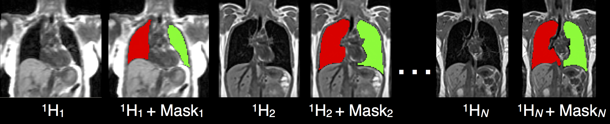
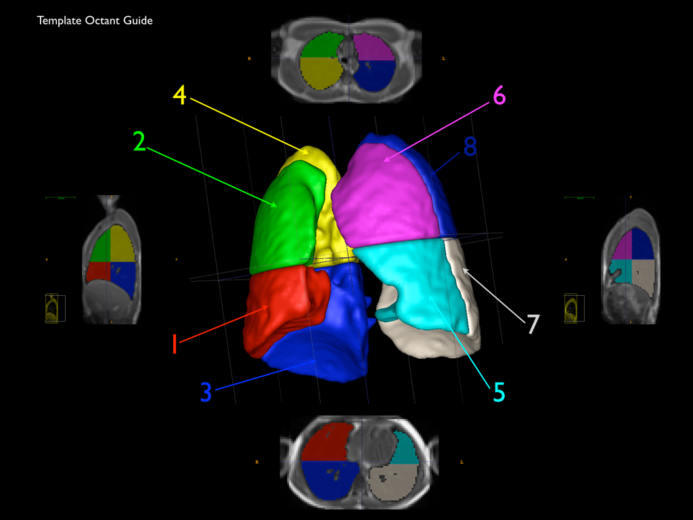
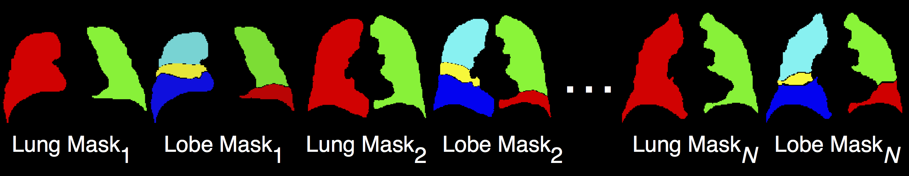
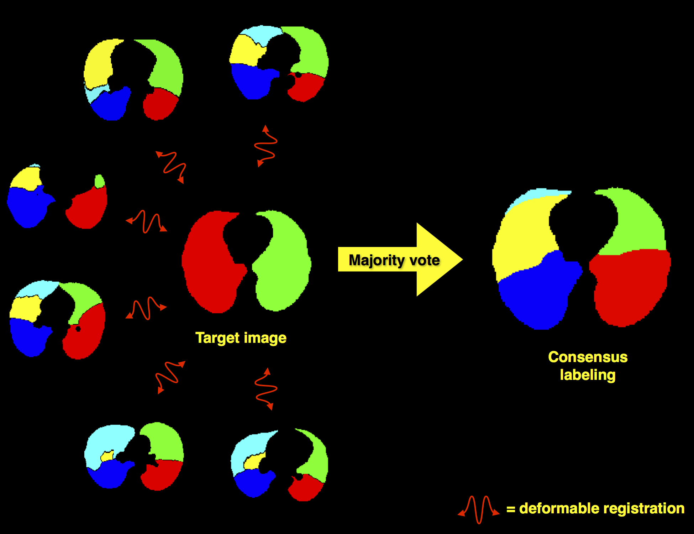

```{r global options, include=FALSE}
library(rmarkdown)
library(knitr)
figpath<-'Figures/'
opts_chunk$set(fig.width=9, fig.height=6, fig.path=figpath,
               warning=FALSE, message=FALSE)
```


# <span style="color:purple;">Whole lung segmentation</span>

##

Given a library of $N$ $^1$H lung MRI with lung masks:

$^1$H$_1$ + Mask$_1$

$^1$H$_2$ + Mask$_2$

$\vdots$

$^1$H$_N$ + Mask$_N$



##

First, we register the lung MRI library to the lung MRI to be segmented, $^1$H$_u$,

<BR>

<span style="color:blue;">Register</span>($^1$H$_u$, $^1$H$_1$) $\rightarrow$ $T_1$

<span style="color:blue;">Register</span>($^1$H$_u$, $^1$H$_2$) $\rightarrow$ $T_2$

$\vdots$

<span style="color:blue;">Register</span>($^1$H$_u$, $^1$H$_N$) $\rightarrow$ $T_N$

<BR>

<HR WIDTH="70%">

<BR>

Each calculated transformation, $T$, registers the corresponding
database image to the unsegmented $^1$H MRI.

##

The MALF algorithm takes the following input:

*  $^1$H$_u$

*  the transformed lung MRI, i.e.,

    * $T_1$($^1$H$_1$),

    * $T_2$($^1$H$_2$), $\ldots$,

    * $T_N$($^1$H$_N$)

* the transformed lung MRI masks, i.e.,

    * $T_1$(Mask$_1$),

    * $T_2$(Mask$_2$), $\ldots$,

    * $T_N$(Mask$_N$)

##

Mask$_u$ $\leftarrow$ MALF(unsegmented $^1$H, transformed lungs, transformed masks)


# <span style="color:blue;">$^1$H MRI lobe estimation</span>

##

Past MRI research has attempted to explore subregions of the lungs by
geometric subdivisions, e.g.,




##

However, these subdivisions

*  have no clinical consensus and

* are not based on internal anatomical structure, such as the lobes.

##

Given the whole lung segmentation described in the <a href="#/whole-lung-segmentation">previous section</a>,
we can _estimate_$^*$  a lobar division by a similar process.


which requires the use of a lobe-annotated lung library which we can derive from CT.

<HR WIDTH="90%">

$^*$ I purposely avoided the use of the word _segmentation_ here since it might have
     confounding connotations.

##

_CT lung mask library for lobe estimation_



* The CT library contains _only_ the whole lung and lobe masks.

* There is no reliable anatomical information inside $^1$H:

    * This makes direct segmentation difficult.

    * However, we can register the $^1$H and CT lung boundaries using the masks, e.g.,

##


$^*$Data and ANTs call available [here](https://github.com/ntustison/ProtonCtLungMaskRegistration).


##

Overview of lobe estimation in $^1$H MRI:

* Step 1:  Segment the whole $^1$H lung MRI as described <a href="#/whole-lung-segmentation">previously</a>.

    * This produces an <a href="#/section-6">$^1$H lung mask</a>.

    * The lung mask is represented as a binary image where

        * <span style="color:red;">label 1 (red)</span> = right lung

        * <span style="color:green;">label 2 (green)</span> = left lung

* Step 2:  Register the CT _whole lung_ masks to the $^1$H lung mask.  Each CT whole
lung mask is defined similarly as the $^1$H lung mask
(i.e., <span style="color:red;">label 1</span> = right lung and
<span style="color:green;">label 2</span> = left lung).

##

Overview of lobe estimation in $^1$H MRI (continued):

* Step 3:   Transform the CT _lobe_ masks to the $^1$H lung mask using the
transforms derived from <a href="#/section-8">Step 2</a>.

* Step 4:  Use _majority voting_ to determine the consensus labeling from the
warped CT lobe masks.

* Step 5:  Remove any pixels from the resulting lobe estimation which are outside
the $^1$H lung mask.

##



##

So the results _look_ good but


how do we quantitatively assess the proposed segmentation/estimate?

# <span style="color:green;">Whole Lung Segmentation Evaluation</span>

##

Whole lung segmentation evaluation is straightforward --- just perform a leave-one out cross-validation:

* For each $^1$H lung MRI in the library:

    * Remove the $^1$H lung MRI from the library to use as the "target."

    * Use the remaining images to segment the target image as described <a href="#/whole-lung-segmentation">previously</a>.

    * Compare the MALF segmentation with the manually annotated segmentation.

* Calculate overlap statistics over all images in the library.

##

**Compare with previous methods I**

<span style="color:green;">Dice</span> comparison with [1].

| Lung | mean	| std | 	min	| max |	median |
|----|----|----|------|------|-----|
| Left	| 0.981 (0.932)	| 0.007 (0.012) |	0.962 (0.897) |	0.990 (0.952) |	0.982 (NA) |
| Right |	0.984 (0.937)	| 0.006 (0.013)	 | 0.957 (0.907) |	0.992 (0.958) |	0.985 (NA) |

Statistics from [1] are in parentheses.

[1] Kohlmann, et al. _Automatic lung segmentation method for MRI-based lung perfusion studies of patients with chronic obstructive pulmonary disease_.  Int J CARS 2014.

Another recent [study](http://www.sciencedirect.com/science/article/pii/S1361841515000511) reports a maximum
<span style="color:green;">Dice</span> performance of $~0.917 \pm 1.8$ using combined
$^1$H and $^3$He images.


##

**Compare with previous methods II**

<span style="color:blue;">Jaccard</span> overlap comparison with best results from [LOLA11](http://www.lola11.com) (whole lung CT segmentation challenge)

| Lung | mean	| std | 	min	| max |	median |
|----|----|----|------|------|-----|
| Left |	0.963 (0.974)	 | 0.013 (0.097) |	0.926 (0.277)	| 0.981 (0.999) |	0.964 (0.992) |
| Right |	0.968 (0.972) |	0.012 (0.135)	| 0.917 (0.000) |	0.983 (0.999)	 | 0.970 (0.996) |

 Statistics from LOLA11 are in parentheses.

*_Note that <span style="color:green;">Dice</span> $\ne$ <span style="color:blue;">Jaccard</span> which
is why our numbers are not the same in both tables even though they are from the same results._

# <span style="color:green;">Lobe Estimation Evaluation</span>

##

_How do we evaluate $^1$H lobe estimation?_

<BR>
<BR>
<BR>
<BR>
<BR>

<HR WIDTH="90%">

*<a href="#/section-6">Remember</a>, I am purposely avoiding the use of the word _segmentation_
to not confuse people as to what we are doing. We are simply making a best guess estimate of where
the lobes are based on alignment of lung boundaries.  Not ideal but better than the
current <a href="#/section-4">alternative</a>.

##

This is much harder to evaluate than the whole lung segmentation:

* There is little, if any, reliable internal anatomical information in $^1$H lung MRI
which implies:

    * Manual lobe segmentation is not feasible for conventional $^1$H lung MRI.

    * Even image registration of MRI and CT images from the same individual are not guaranteed
      to be in alignment *internally*.

<span style="color:red;">_Thus, using $^1$H lung MRI directly for evaluation is extremely difficult
(if not impossible) with our current acquisition and processing capabilities._</span>


## __However__,

notice something about our actual methodology, described <a href="#/section-9">previously</a>:

<span style="color:red;">_The actual lobe estimation steps (Steps 2, 3, 4, 5) are completely agnostic
with respect to the original $^1$H lung MRI---only the lung mask is used._</span>

##

So we can revise our original evaluation question from

<span style="color:red;"><del>_How do we evaluate $^1$H lobe estimation?_</del></span>

to an equivalent

<span style="color:blue;">_How do we evaluate lung mask$^*$ lobe estimation?_</span>

<BR>
<HR WIDTH="70%">

$^*$This is the _key_ point:  If we assume that a _hypothetical_ $^1$H lung mask is equivalent
to its CT counterpart, then we can perform a methodological evaluation using the
<a href="#/section-7">CT library</a>.

##

We perform a leave-one out cross-validation with
<a href="#/section-7">CT library</a>:

* For each Lung Mask$_i$ (= hypothetical $^1$H lung mask$_i$):

    * Remove Lung Mask$_i$ from the set to use as the "target."

    * Downsample Lung Mask$_i$ to resolution of the proton images (for improved comparability--although
    this step did not make much difference).

    * Use the remaining images to segment the target image as described <a href="#/section-9">previously</a>
    (only Steps 2, 3, 4, 5).

    * Compare the Majority Voting estimation with the manually annotated lobe segmentation.

* Calculate overlap statistics over all images in the library.

##

**Compare with related methods**

<span style="color:blue;">Jaccard</span> overlap comparison with best results from [LOLA11](http://www.lola11.com) (whole lung CT segmentation challenge)

| Lobe | mean	| std | 	min	| max |	median |
|----|----|----|------|------|-----|
L upp |	0.882 (0.922)	 |	0.059 (0.163) |		0.670 (0.198)	 |	0.969 (0.997) |		0.894 (0.978) |
L low |	0.868 (0.885)	 |	0.06 (0.229)	 |	0.711 (0.0) |		0.966 (0.996) |		0.892 (0.964) |
R upp |	0.852 (0.921)	 |	0.067 (0.088)	 |	0.624 (0.604)	 |	0.931 (0.998)	 |	0.875 (0.96) |
R mid	 |	0.657 (0.765)	 |	0.130 (0.299) |		0.402 (0.0) |		0.903 (0.945)	 |	0.696 (0.886) |
R low	 |	0.873 (0.914) |		0.063 (0.176) |		0.706 (0.0) |		0.956 (0.998) |		0.900 (0.968) |

 Statistics from LOLA11 are in parentheses.


